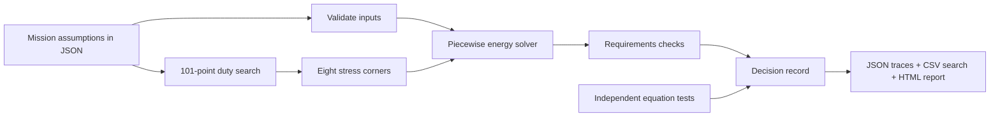

# OrbitBench: engineering dossier

## 1. Selected solution and intended user

Develop a **CubeSat electrical-power analysis and verification workbench** that a local university or engineering company can maintain and extend. Its first user is an electrical-power subsystem (EPS) engineer evaluating whether an early mission concept has a viable energy budget.

The concrete question is: **For the declared orbit, storage, generation, and load assumptions, what payload duty can satisfy the energy constraints under specified stresses?** The output is a repeatable decision record with raw evidence, rather than an unsupported statement that a component is ready for space.

This focuses on the brief's design/test-tool and digital-simulation opportunities. It is deliberately a ground engineering software product. A complete EPS board or CubeSat would require hardware, facilities, and evidence absent from the supplied resources.

## 2. Why this is a localization project

The target external dependency is reliance on externally maintained analysis scripts, proprietary integrations, or repeated external analysis services for early power-budget checks. Whether a particular institution currently has that dependency must be established in pilot interviews; no existing spend is assumed.

The delivered capability includes the solver, requirement checks, design search, verification tests, report generator, and documented interfaces. A local team can inspect and modify the implementation. Subsequent instrument drivers and test procedures can build local engineering expertise and an ongoing service around the software.

This is not a claim that importing instruments becomes unnecessary. It separates the locally developed engineering capability from hardware procurement and laboratory calibration dependencies.

## 3. Interpretation of every brief page

| Source | Brief expectation | Response |
|---|---|---|
| Space Industry Sources p1 | Sustainable local development of components, technologies, or services | Locally maintainable engineering software and proposed validation service |
| p1 | Translate mission needs into engineering requirements | Explicit input contract, energy requirements, and payload tradeoff |
| p1 | Tools for design/testing, simulation, suppliers, TRL, or lifecycle management | Select design/testing and simulation; provide a bounded TRL/supply plan |
| p2 | Identify a capability that can replace an external dependency | Early EPS design checks; actual institutional dependency to be confirmed |
| p2 | Define constraints, prototype, verification tests, before/after TRL | Runnable prototype, eight tests, analytical results, conservative maturity assessment |
| p3 | State what is developed locally and the needed supply chain | Development boundary and dependency register in the localization plan |
| p3 | Explain the route from prototype to product | Bench validation, pilot, service packaging, and support milestones |
| p3 | Demonstrate measurable practical value | Detect infeasibility and reproduce a constrained design comparison |

The PDFs do not prescribe team roles, mandatory AI models, judging weights, event duration, or a product format. The roles, numerical assumptions, and schedule in this package are our proposals.

## 4. Engineering requirements

| ID | Requirement | Evidence/verification | Status |
|---|---|---|---|
| IN-01 | Reject invalid or non-finite mission inputs | Automated invalid-input tests | Implemented |
| MOD-01 | Conserve energy in simple charge/discharge cases, accounting for efficiencies | Independent algebraic expected values | Verified in tests |
| MOD-02 | Respect sunlight/eclipse boundaries for fractional durations | Step-invariance comparison | Verified in tests |
| EPS-01 | No unmet load energy over the modeled interval | `unserved_wh = 0` within numerical tolerance | Evaluated per design |
| EPS-02 | SOC never below declared reserve | Minimum simulated SOC ≥ configured minimum | Evaluated per design |
| EPS-03 | Nonnegative ideal per-orbit storage balance | Computed net Wh/orbit ≥ 0 | Evaluated per design |
| OPT-01 | Return maximum feasible duty on the declared grid, or no candidate | Full 101-value search; next-higher point fails in example | Verified |
| ROB-01 | Candidate satisfies every declared corner | Eight corner records | Verified for example |
| REP-01 | Retain configuration, source hashes, traces, and tests | JSON/CSV/HTML evidence package | Implemented |
| LOC-01 | Another local engineer can rerun and modify the source | Independent operator reproduction trial | Procedure ready; external trial pending |
| VAL-01 | Model predictions agree with measured bench data within agreed limits | Laboratory validation | Pending equipment/data |

EPS thresholds are example mission constraints, not NASA universal limits. Passing them means passing this simplified model, not the entire mission.

## 5. Architecture and implementation

| Module | Responsibility |
|---|---|
| `orbit.py` | Validation, energy integration, requirement checks, single-design CLI |
| `engineering.py` | Assumed corner generation, assessment, bounded search |
| `report.py` | Static evidence report with nominal battery traces |
| `run.py` | Test execution, pipeline orchestration, output and source hashes |
| `tests/test_orbit.py` | Algebraic checks, boundary behavior, infeasibility, input rejection |

No database or cloud service is necessary for the pilot. JSON configurations can be reviewed alongside requirements. Introduce persistent project storage and user management only after actual multi-user needs are established.

## 6. Input contract and example assumptions

| Field | Meaning | Example |
|---|---|---|
| `period_min` | Fixed repeating orbital period in minutes | 95 |
| `eclipse_min` | Eclipse duration per orbit | 35 |
| `solar_w` | Available electrical power at the modeled bus in sunlight | 8 W |
| `base_w` | Continuous base load | 2 W |
| `payload_w` | Additional payload load when active | 6 W |
| `payload_duty` | Fraction of modeled time assigned to payload; averaged | 0.65 initially |
| `battery_wh` | Effective usable battery energy capacity at the modeled conditions | 20 Wh |
| `initial_soc` | Initial stored energy/capacity | 0.80 |
| `min_soc` | Required minimum reserve fraction | 0.30 |
| `charge_efficiency` | Bus surplus to stored-energy efficiency | 0.90 |
| `discharge_efficiency` | Stored energy to bus-load efficiency | 0.90 |
| `orbits` | Number of repeated orbits | 16 |

Inputs are assumed examples. The 16-orbit horizon is about 25.33 hours. `solar_w` is bus-available power, not a panel nameplate rating; solar geometry, temperature, and upstream conversion losses must be accounted for when choosing it. Charge/discharge efficiencies represent the remaining modeled storage path, avoiding double-counting.

## 7. Energy model

Let average load be `Pload = Pbase + duty × Ppayload`.

Within a constant illumination segment, bus energy surplus is `(Psolar - Pload) × Δt_hours`. Positive surplus increases storage after multiplication by charge efficiency. Negative surplus removes stored energy after division by discharge efficiency.

Storage is bounded between zero and capacity. Any unmet load after storage empties is recorded as bus-side unserved Wh; any generation that cannot be stored is recorded as curtailed bus-side Wh. The solver ends a segment exactly at sunlight/eclipse transitions, even if a requested step would cross them.

The per-orbit sustainability check computes net storage change without capacity clipping. This is separate from a finite-horizon reserve check: a large initial battery can conceal an unsustainable design temporarily. Both checks are required.

**Excluded physics:** instantaneous payload on/off scheduling, peak current, voltage and brownout dynamics, charge/discharge power limits, temperature, battery aging, self-discharge, detailed solar geometry, attitude, degradation dynamics, transient faults, and mission-specific operating modes. Averaging duty can hide peak and eclipse-time problems. These exclusions must be resolved before operational use.

## 8. Design search and actual result

The optimizer is deterministic exhaustive search, not machine learning. It tests duties from 0.00 through 1.00 in steps of 0.01. Each is evaluated at eight combinations:

- Solar multiplier: 1.00 or 0.75.
- Eclipse extension: 0 or 5 minutes.
- Battery-capacity multiplier: 1.00 or 0.80.

These are explicit engineering assumptions, not probability distributions. The result is optimal only on this grid under this model and these constraints. It does not establish global optimum, reliability probability, or robustness to unmodeled conditions.

| Metric | Initial, 65% duty | Candidate, 19% duty |
|---|---:|---:|
| Nominal minimum SOC | 0% | 80% |
| Nominal unmet energy | 13.451 Wh | 0 Wh |
| Nominal net storage balance | -1.934 Wh/orbit | +2.339 Wh/orbit |
| All eight specified corners | Not all pass | All pass |

At 19%, worst-corner surplus is only **0.0336 Wh/orbit**. This is a feasibility boundary, not a comfortable operating margin. A separately evaluated 15% example has **0.4094 Wh/orbit** worst-corner surplus. These are model results, not measured operating limits.

The tradeoff is substantial: if payload duty of 65% is mandatory, reducing it does not solve the mission. Instead, reject the architecture and investigate more generation, lower continuous load, or changed mission needs. Additional battery capacity alone cannot fix a long-term negative energy balance.

## 9. AI strategy

The AI resource guide permits automation and predictive systems and does not require an LLM. The delivered numerical decision engine uses transparent equations and exhaustive search. It is not labeled “AI-powered.”

A justified later ML component could learn prediction residuals from bench telemetry across temperature and load states. Its target would be measured SOC or delivered-energy error, not arbitrary synthetic labels. Split evaluation by physical unit and test campaign; compare against the physics-only model and report error under withheld conditions. Adopt it only if it improves accuracy without hiding constraint violations.

An optional language model may draft explanations from approved requirement/result records, with references. It must not invent ratings, set TRL, or override failures. This extension is not implemented and is not needed for the current proof of concept.

## 10. Evidence, novelty, and limits

Eight tests passed. The 808-case search executed in approximately 0.36 seconds on this run; timing is machine-dependent and not a product speed guarantee. Complete logs and hashes are in `output/`.

The contribution is a maintainable engineering workflow and localization path; the underlying energy equations are not novel. Global novelty or advantage over established tools has not been established. NASA S3VI provides mission tools and small-spacecraft resources that should inform a later comparison. [NASA S3VI](https://www.nasa.gov/smallsat-institute/)

NASA distinguishes product verification against requirements from validation against intended use. The current tests support numerical verification; measured bench comparison and user trials are still needed for validation. [NASA Product Realization](https://www.nasa.gov/reference/5-0-product-realization/)
