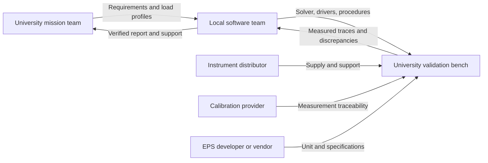

# Localization, verification, and product maturity

## 1. Local development boundary

The target is a locally controlled **engineering software and validation-service capability**. Country, host university, and confirmed partners have not been specified. The plan is suitable for a proposed Iraqi/Arab university pilot, but no institution or supplier is represented as a committed partner.

| Capability | Delivered now | Local development opportunity | External dependency |
|---|---|---|---|
| Energy calculations | Inspectable Python solver | Model maintenance and mission-specific extensions | Python runtime |
| Requirement evaluation | Explicit thresholds and result records | Local engineering review and requirement management | Mission/component specifications |
| Design exploration | Reproducible corner/grid search | Additional design variables and approved stress sets | Validated model limits |
| Evidence generation | Source hashes, raw outputs, test log, report | Review templates and traceability integration | Independent acceptance process |
| Test-bench integration | Interface plan only | Instrument adapters, procedures, fixtures | Instruments, calibration, lab access |
| Hardware manufacture | None | Potential future fixture/adapter design | Components, assembly and inspection |
| Flight qualification | None | Future specialist collaboration | Relevant facilities and mission authority |

Local value should be measured by the team's ability to operate, modify, verify, and support the capability. Owning the report output alone does not establish localization. Legal ownership and third-party license review should be recorded before commercial release; no country-of-origin certification is implied.

## 2. Supply-chain and partnership map

| Dependency | Proposed partner type | Selection evidence | Current status | Fallback |
|---|---|---|---|---|
| Mission requirements | University CubeSat team | Named owner, signed-off power profile | Unconfirmed | Maintain explicitly assumed example |
| Software ownership/support | Local engineering team | Named maintainers, reproduction and change exercise | Source delivered; team assignment pending | Single-machine source handoff |
| Bench access | University electronics laboratory | Instrument list, access agreement, competent operator | Unconfirmed | Analytical prototype only |
| Programmable supply | Authorized distributor or existing lab | Datasheet, supported range/protocol, service availability | Not selected | Borrow compatible laboratory equipment |
| Electronic load | Lab or distributor | Load range, timing, accuracy, API support | Not selected | Controlled fixed-load cases for initial validation |
| Calibration | Qualified provider | Valid certificates and uncertainty statements | Not selected | Do not make measurement-accuracy claims |
| EPS unit | University project or vendor | Interface documentation and test limits | Not selected | Battery emulator for solver validation first |

No quotations, lead times, or local-manufacture percentages are claimed. Before procurement, compare at least two feasible sources per critical item, inspect compatibility, and record warranty/service, calibration, lead time, and import dependencies. Do not use an unverified supplier directory as evidence of qualification.

## 3. Technology readiness assessment

ESA describes TRL as an evidence-based maturity scale from 1 to 9. Ratings depend on the technology and demonstrated environment. [ESA TRL reference](https://www.esa.int/Enabling_Support/Space_Engineering_Technology/Shaping_the_Future/Technology_Readiness_Levels_TRL)

**Assessment object:** OrbitBench's bounded ground-software concept, not EPS hardware and not a spacecraft.

| Stage | Proposed level | Required evidence | Current assessment |
|---|---|---|---|
| Defined concept before implementation | TRL 2 | Use case, formulation, initial feasibility | Reasonable provisional baseline |
| Analytical/experimental software proof of concept | Candidate TRL 3 | Executable critical functions and documented proof-of-concept results | Current source and tests support review at this level; not certified |
| Laboratory-validated software/bench integration | Target TRL 4 | Independent measured cases, interfaces, repeatability, discrepancies resolved | Not achieved |
| Representative pilot environment | Later level to be assessed | Intended users, representative equipment and conditions, reviewed evidence | Not achieved; no automatic rating |

Thus the proposed before/after is **TRL 2 → candidate TRL 3**, subject to independent technical review. Numerical unit tests alone do not establish physical model accuracy. No spacecraft or hardware maturity increase is inferred.

TRL is not a percentage of completed tasks. One missing critical capability can prevent progression regardless of how many documents are finished. Maintain an evidence ledger with artifact ID, configuration, environment, date, reviewer, and unresolved limitations.

## 4. Verification versus validation

### Executed software verification

| Test | Independent property checked |
|---|---|
| Pure discharge | Energy loss equals load × duration / discharge efficiency |
| Constant sunlight and full storage | Charge saturation and curtailed generation match arithmetic |
| Depleted storage | Unserved bus energy accounts for usable stored energy |
| Fractional illumination boundaries | Different step sizes produce matching segment results |
| Infeasible design and search | Initial failure detected; best candidate passes; next grid value fails |
| No feasible candidate | Impossible case returns no configuration |
| Invalid inputs | Reject strings, booleans, nonfinite values, invalid durations/capacity, oversized traces |
| Zero load | Storage stays constant without spurious deficit |

The test log in the package records eight passes. These tests verify the implemented mathematical model. They do not emulate a calibrated laboratory or prove operational safety.

### Proposed laboratory validation

1. Agree a test article, voltage/current limits, instrumentation, and uncertainty budget with the lab owner. Start with an emulator and controlled loads before a physical battery.
2. Record serial numbers, firmware, calibration dates, wiring version, timestamps, and the exact software/configuration hashes.
3. Exercise constant discharge, constant charging, saturation, eclipse transitions, and timed load profiles across the intended parameter domain.
4. Log time, bus voltage/current, measured generation/load, estimated/reference storage energy, temperature, and instrument status.
5. Align time bases and integrate measured power. Account for instrument uncertainty and any independent SOC reference limitations.
6. Compare predictions with held-out test cases; review deviations before tuning. Reserve a later campaign and, if possible, another unit for final validation.
7. Publish residuals and failures. Do not discard difficult cases merely to reach a target.

Proposed initial acceptance targets, to be agreed before observing final data: ≤5% delivered-energy error in the declared operating domain, and ≤5 percentage points SOC error where the SOC reference supports that resolution. These are planning targets, not existing results or universal spacecraft requirements.

Future time-varying-load validation is mandatory before evaluating peak loads or payload schedules. The current averaged-duty solver is not sufficient for those claims.

## 5. Risk register

| Risk | Consequence | Mitigation and owner |
|---|---|---|
| Average load hides peaks | Feasible energy result masks electrical overload | EPS lead adds current/power limits and actual load profiles |
| Weak energy margin | Small unmodeled losses invalidate the candidate | Systems lead sets explicit reserve/surplus margins before acceptance |
| Duty reduction violates mission objective | “Improved” design cannot perform its task | Mission owner treats payload requirement as a hard constraint |
| Inaccurate usable capacity | SOC estimates misleading | Lab lead validates effective capacity by conditions |
| Unverified instrument calibration | Claimed agreement has no traceability | Lab lead records uncertainty and calibration |
| Supplier access unavailable | Bench milestone delayed | Project lead confirms facilities before promising hardware evidence |
| Only one maintainer | Local capability is fragile | Software lead trains a second maintainer and runs handoff exercise |
| Unsupported TRL claim | Reviewers cannot trust maturity assessment | Independent reviewer signs evidence-based assessment |

## 6. Measuring localization value

| Metric | How to establish it | Current evidence |
|---|---|---|
| Independent reproducibility | Another engineer reruns from the archived configuration | Automated run exists; external operator trial pending |
| Local modification capacity | Team adds one documented requirement and its test without vendor help | Source/interfaces supplied; exercise pending |
| Engineering turnaround | Compare timed, matched manual and tool-assisted tasks | Search time measured; no controlled human comparison yet |
| Error detection | Predeclared faulty configurations and independent expected results | Software tests demonstrate bounded cases |
| Dependency reduction | Compare actual previous workflow with deployed local workflow | Baseline institutional dependence unknown |
| Local economic value | Costed local work and service delivery versus actual alternatives | No cost savings or procurement figures claimed |

Avoid reporting “100% localized” based on lines of code. Measure which critical activities local staff can execute and sustain, and identify the dependencies that remain.

## 7. Product and commercialization path

**Pilot product:** a reviewed engineering report and reproducible analysis package for a university CubeSat concept. **Next product:** software with instrument integration and locally delivered test services. **Possible revenue model:** support, integration, training, and test campaigns; pricing requires customer interviews and actual delivery costs.

Milestones: confirm pilot/requirements → validate one instrument interface → measured laboratory comparison → independent operator trial → supported release with a maintenance plan. Suggested 30/60/90-day checkpoints are targets, not promises: agree the pilot by day 30, complete initial bench comparison by day 60 if facilities are available, and assess repeatability and customer value by day 90.

The brief's [NASA SBIR/STTR](https://www.nasa.gov/sbir_sttr/), [ESA OSIP](https://technology.esa.int/page/funding-your-ideas), and [ESA InCubed](https://incubed.esa.int/) links provide examples of technology development/commercialization pathways. They are not confirmed funding routes for this team. Eligibility, scope, and current opportunities need a separate assessment before any application.
