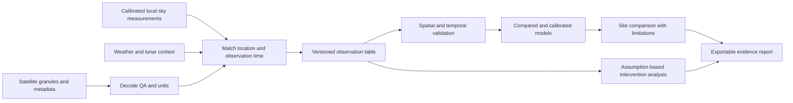

# Layl | ليل

## 1. Decision and product promise

Build a **ground-calibrated sky-quality decision tool** for a university astronomy club planning observing sessions. It combines satellite night-light context with local sky measurements, presents evidence-backed comparisons, and explores lighting changes with transparent assumptions.

The user decision is concrete: **Which candidate site merits a field visit, and which lighting change merits a measured pilot?** The prototype should reduce uncertainty in that decision, rather than claim to identify every polluting lamp or forecast every observing condition.

Baghdad and its surrounding area are the provisional geographic case. That choice is an assumption awaiting team confirmation. The software contains a coordinate demonstration near Baghdad; it contains no actual local survey.

**Current maturity:** runnable analytical software with synthetic tests. Scientific validation and a real Arab-site demonstration are pending. This package does not yet satisfy those parts of the brief.

## 2. Why this scope

| Candidate approach | Strength | Main delivery risk | Decision |
|---|---|---|---|
| Satellite radiance map alone | Quick visual context | Does not establish local observing quality | Retain as supporting context |
| Ground-calibrated sky-quality comparison | Explicit target, testable model, useful astronomy decision | Needs authentic matched measurements | Core solution |
| Individual fixture detection from satellites | Potential municipal action | Insufficient fixture labels and spatial detail for the proposed input | Exclude from MVP |
| Full astronomical scheduling | Useful operational extension | Requires ephemerides, weather, horizon, and target constraints | Later increment |
| Lighting retrofit optimizer | Strong action story | Requires inventory, constraints, and validated impact model | Sensitivity analysis now; field pilot later |

This is an engineering choice under limited data and time, not a claim that one approach is universally best.

## 3. Requirements traced to the brief

LP refers to the supplied Light Pollution Sources PDF.

| ID | Origin | Requirement | Verification | Current status |
|---|---|---|---|---|
| LP-01 | p2 | Define study region and measurement target | Region and target in data manifest | Proposed region; SQM target specified |
| LP-02 | p1–2 | Use appropriate satellite and field context | Authentic matched dataset with provenance | Input contract ready; data pending |
| LP-03 | p2 | Clean data and handle unsuitable observations | QA and malformed-input tests | Implemented for preprocessed CSV |
| LP-04 | p2–3 | Test against actual measurements | Untouched local evaluation | Pending field data |
| LP-05 | p3 | Document source, units, accuracy, limitations | Manifest plus model card | Protocol supplied; authentic manifest pending |
| LP-06 | p2–3 | Deliver usable map/interface or decision model | Run end-to-end and inspect output | CLI and offline report implemented |
| LP-07 | p2 | Show current/scenario comparison | Scenario calculation plus assumptions | Implemented as sensitivity analysis |
| LP-08 | p3 | Include a real Arab-location example | Local observations and site review | Pending; synthetic map is insufficient |
| LP-09 | p3 | Demonstrate measurable practical value | Prospective site-selection or intervention experiment | Experiment designed; not executed |
| LP-10 | p3 | Relate recommendations to responsible lighting | Trace each proposed action to a principle | Included below |

The innovation examples are not interpreted as an obligation to implement every feature. The narrower MVP is designed to demonstrate one useful decision well.

## 4. Scientific target and boundaries

The primary target is a zenith Sky Quality Meter reading in **mag/arcsec²**, from a documented instrument and observing protocol. Higher values mean a darker measured sky. Observations made with different instruments or methods need compatibility checks.

Satellite upward radiance and a ground observer's sky brightness are different quantities. The model must learn an empirical relationship from matched observations. Never rename satellite radiance as SQM, Bortle class, or limiting magnitude. The Black Marble guide describes corrected night-light data, including product-specific quality information; the exact product metadata govern ingestion. [NASA Black Marble Collection 2 guide](https://landweb.modaps.eosdis.nasa.gov/data/userguide/BlackMarbleUserGuide_Collection2.0_20241203.pdf)

Globe at Night includes different measurement types. Naked-eye limiting magnitude and SQM readings must be treated separately; do not put both into one regression target. [Kyba et al., citizen-science night-sky study](https://doi.org/10.1038/SREP01835)

The current simple model estimates brightness, not atmospheric seeing, transparency, target visibility, or travel suitability. Moon altitude, Sun altitude, aerosol behavior, local obstacles, and distant light sources can matter. The four-feature demo is a baseline architecture, not an operational forecast.

## 5. Architecture

Implemented boundary: the versioned observation table onward for spatial model evaluation and a synthetic report. Ingestion, time alignment, real inference-service operation, and field evaluation are specified but not implemented.

Use a local batch architecture first: CSV input, numerical model, JSON evidence, offline report. It is easy to inspect and rerun without network dependencies. Add a service/database only after a real user workflow needs it.

## 6. AI method

**Implemented model:** ridge regression over log(1 + radiance), cloud fraction, lunar illuminated fraction, and aerosol optical depth (AOD). Features are standardized within each training fold. A small fixed regularization coefficient avoids a tuning loop in the demonstration.

**Baselines:** training-fold median SQM and a radiance-only ridge model. Both use the same held-out rows as the multi-feature model. This answers whether contextual features add value, rather than merely whether a model fits data.

**Validation:** leave one declared spatial block out at a time. All dates for a site remain within one block. The model is refit from training rows for each fold; withheld labels cannot influence its predictions. A separate test checks this directly by changing withheld labels and confirming unchanged predictions.

**Next model comparison, conditional on data:** compare the baseline with gradient-boosted trees under identical blocked folds and a final untouched temporal test. Prefer the simpler model unless added complexity produces repeatable improvement. If labels are scarce, show measured observations and satellite context separately and state that calibrated prediction is unavailable.

**Uncertainty:** current output reports held-out error distributions, not confidence intervals. A deployment version should reserve geographically separated calibration blocks for interval calibration, test coverage on untouched blocks, and flag inputs outside training support. Do not display a generic “95% confidence” badge based on training residuals.

**Generative AI:** optional after the numerical pipeline works. It may explain verified outputs using retrieved evidence. It must not generate measurements, invent data provenance, or choose model outputs. A chatbot is not needed for the core task.

## 7. User journey and product acceptance

1. The analyst selects a defined study area and date range, supplies authenticated observations, and reviews provenance and quality exclusions.
2. The tool evaluates the model and displays both baseline results. If evidence is inadequate, the output says so rather than offering a calibrated recommendation.
3. The observer compares candidate sites for a matched period. Operational development must add permissions/access, horizon, weather, and astronomical darkness constraints.
4. The analyst inspects lighting scenarios, changes assumed parameters, and exports an evidence note for a field trial.
5. After the trial, the team compares predicted and measured changes and revises the model.

Current report implements a static demonstration of steps 2–4. Real input evaluation and report export are available through the CLI. The report generated by `demo.py` is intentionally fixed to synthetic data; `sky.py --report` renders supplied data with its provenance notice. Neither is a live map or a deployed application.

For the real release, do not average weather-confounded scores into a permanent ranking. Compare common conditions or explicitly label date-specific outcomes. When differences are smaller than measured predictive uncertainty, show sites as statistically unresolved instead of assigning a precise order.

## 8. Intervention model

For a measured starting brightness m, an assumed artificial share f of ground sky luminance, and an assumed reduction r of that share:

`m_after = m_before - 2.5 × log10(1 - f × r)`

Assumptions: natural brightness remains constant; the artificial contribution scales linearly; atmospheric conditions and measurement configuration remain comparable. The artificial share is an input assumption, not something the current model identifies.

Example: m = 18.00, f = 0.60, r = 0.40 gives approximately **18.30 mag/arcsec²**. That is a hypothetical gain of approximately 0.30, not a measured local outcome. The software explores multiple f and r values instead of presenting one unjustified estimate.

| Responsible-lighting principle | Proposed pilot action | Evidence needed |
|---|---|---|
| Purpose | Remove unnecessary operation after a usage review | Actual use and local needs |
| Direction | Shield/aim fixtures at the intended area | Fixture survey and spill-light checks |
| Appropriate level | Reduce output where task lighting permits | Relevant lighting requirements and measured levels |
| Timing | Apply a schedule or controls during unused periods | Operating log and observed use |
| Spectrum | Consider warmer sources where appropriate | Fixture specifications and spectral limitations |

These actions follow the general framework of [DarkSky's five lighting principles](https://darksky.org/resources/guides-and-how-tos/lighting-principles/). Numeric settings require a local lighting assessment. Shielding alone does not imply energy savings. Savings must be calculated from fixture power and verified runtime, not from a satellite-radiance percentage.

## 9. Model card and risk register

| Topic | Current statement | Mitigation or release gate |
|---|---|---|
| Training data | Synthetic, fixed seed, model-like generating function | No field accuracy claim; replace with real matched data |
| Geography | Illustrative Baghdad-area coordinate box | Confirm region and verify real sites |
| Bias | Sparse convenient observing locations may dominate | Stratify across brightness, land use, and access |
| Spatial dependence | Nearby sites share light sources and weather | Blocks and buffers selected before fitting |
| Temporal dependence | Adjacent dates share conditions | Untouched later-date evaluation |
| Sensor changes | Instrument offsets can look like spatial effects | Calibration, sensor IDs, and cross-checks |
| Cloud/aerosol complexity | Simple linear terms may be inadequate | Residual analysis by conditions; restrict intended domain |
| Missingness | Current schema rejects missing features | Use a documented reduced model; do not fill unknowns with zero |
| Radiance negatives | Current prototype rejects negatives | Inspect product uncertainty/noise and record the preprocessing decision |
| Extrapolation | Current evaluator has no deployment OOD gate | Keep it in evaluation mode; add support checks before serving predictions |
| Causal effects | Scenario assumes rather than identifies impact | Controlled before/after field evaluation |
| Individual sources | Bright pixels cannot uniquely identify fixtures | Ground inventory before attribution |
| Operational use | No validated observation recommendation | Astronomy lead reviews access and observing constraints |

## 10. Definition of a submission-ready result

The core software is ready to demonstrate. The challenge solution becomes evidence-ready only when the team can show: an authentic local data manifest; a defined target and matching procedure; untouched local evaluation versus baselines; a usable report with limitations; and measured decision value or an honestly bounded pilot outcome.

If these data gates cannot be met before submission, present Layl as a tested software proof of concept with a documented validation gap. Do not promote synthetic metrics into scientific claims.
